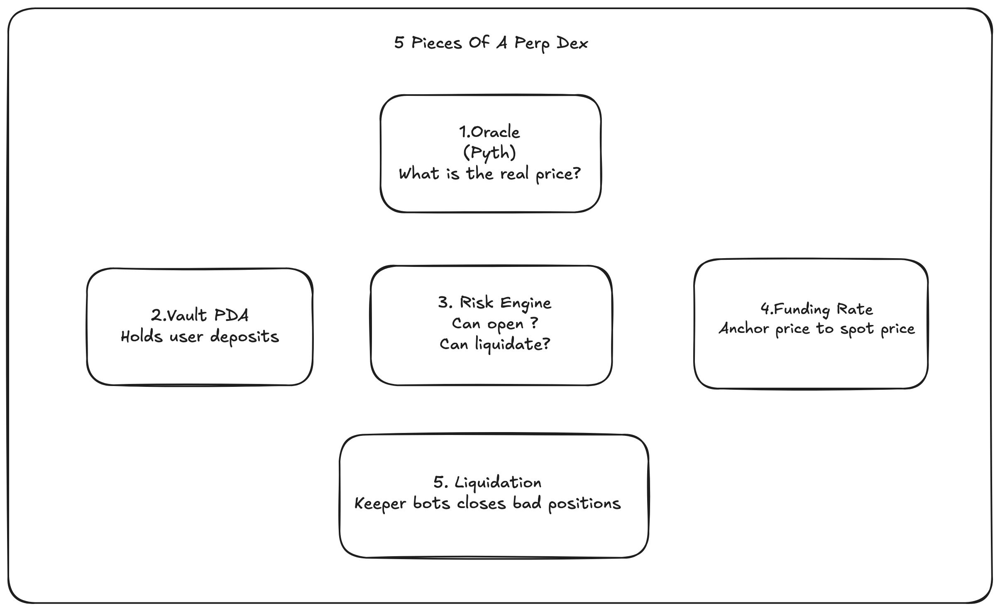

# perps-lab

An educational project to build a new Perpetual Decentralized Exchange (Perp DEX) on Solana, designed by incorporating Anatoly Yakovenko's **Percolator** risk engine math and other bleeding-edge innovations.

---

## Core Architecture Components

Here are the 5 core pieces of a Perp DEX architecture:

### 🔮 Piece 1 — Oracle
* **Concept:** The source of truth for price. 
* **Implementation:** Pyth on Solana.
* **Why it matters:** Without it, no one knows what a position is worth.
* **Risk:** This is the #1 attack surface. Mango Markets lost $100M because someone manipulated the oracle price.

### 🏦 Piece 2 — Vault
* **Concept:** A PDA (Program Derived Address) that holds all the money.
* **Implementation:** Users deposit into it, and the program controls who can withdraw.
* **Core Invariant:** 
  $$\sum \text{all\_user\_balances} \le \text{vault\_balance}$$
  *Never break this.*

### 🧮 Piece 3 — Risk Engine
* **Concept:** The MATH. This is Percolator.
* **Responsibilities:** It answers:
  * *"This user deposited X. Can they open a Y-sized position?"*
  * *"Market moved. Is anyone underwater?"*
  * *"How much can this user withdraw?"*

### ⚖️ Piece 4 — Funding Rate
* **Concept:** The mechanism that keeps perp price aligned with spot price.
* **Implementation:** Every $N$ seconds, one side pays the other.
* **Formula:** 
  $$\text{Funding Rate} = \frac{\text{perp\_price} - \text{spot\_price}}{\text{spot\_price}}$$
* **Dynamics:** Positive rate $\rightarrow$ longs pay shorts. Negative rate $\rightarrow$ shorts pay longs.

### ⚡ Piece 5 — Liquidation
* **Concept:** Handling undercollateralized accounts.
* **Mechanism:** When someone's collateral drops below maintenance margin, a "keeper" bot closes their position and takes a fee.
* **Fallback (ADL):** If no bot executes the liquidation, the protocol does an ADL (auto-deleveraging) — forcibly matching underwater longs against underwater shorts.

---

## System Architecture

---

## Repository Structure

- `perp-dex/`: Anchor project containing the Solana program codebase.
- `research/`: Detailed research on perpetual futures design, including Percolator risk math and literature reviews.
  - [perp-dex-design-v1-replace-percolator.md](file:///Users/amalnathsathyan/Documents/trycatchblock/learning/perps-lab/research/perp-dex-design-v1-replace-percolator.md): Design proposal substituting Percolator risk model.
  - [perp-dex-design-v2-wrapper.md](file:///Users/amalnathsathyan/Documents/trycatchblock/learning/perps-lab/research/perp-dex-design-v2-wrapper.md): Design proposal wrapping Percolator.
  - [perp-futures-literature-review.md](file:///Users/amalnathsathyan/Documents/trycatchblock/learning/perps-lab/research/perp-futures-literature-review.md): In-depth literature review on perpetual futures.
- [perpetual_futures_research.md](file:///Users/amalnathsathyan/Documents/trycatchblock/learning/perps-lab/perpetual_futures_research.md): Core research document summarizing current paradigms and Percolator's innovations (Haircut Ratio $H$, Lazy indices).
- [perps-chat-export.md](file:///Users/amalnathsathyan/Documents/trycatchblock/learning/perps-lab/perps-chat-export.md): Export of the initial deep research chats.
